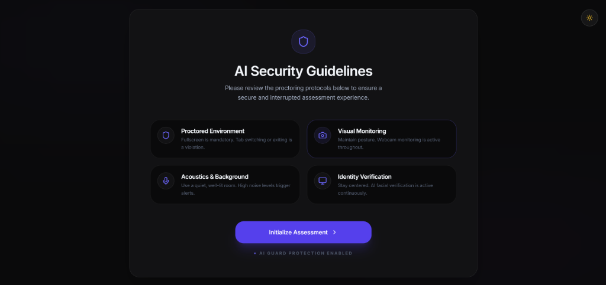
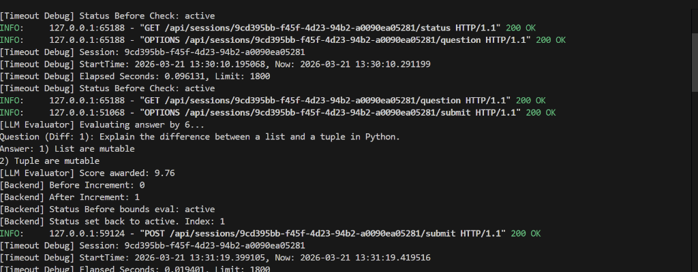
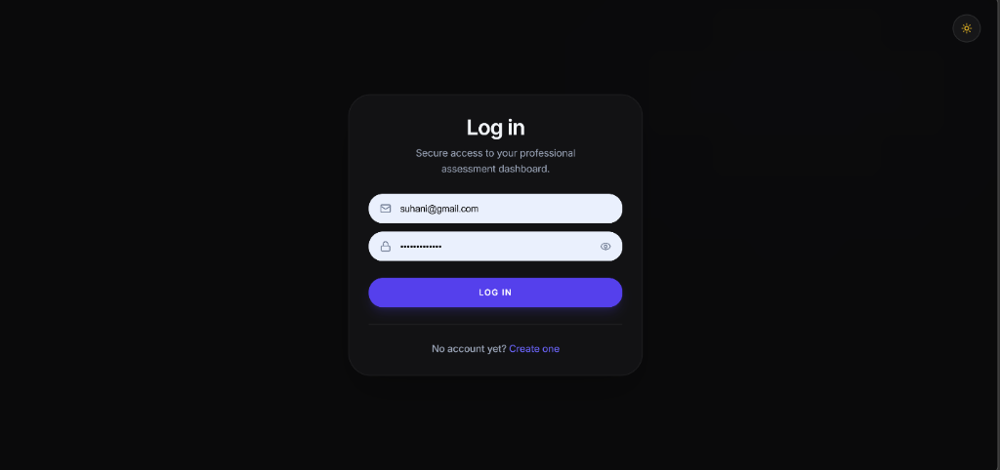

# 🚀 AI-Based Full-Stack Assessment & Proctoring System

An enterprise-grade, fully integrated interview platform designed to simulate real-world technical assessments securely. Driven by a dedicated React (Vite) frontend, a high-performance Python FastAPI engine conducts real-time LLM feedback Scoring securely without interval cap spams.

---

## 📌 Project Overview

This architecture bridges interactive single-page application metrics with Procedural Evaluation Backends for high-load interview assessment loops. 
Candidates select specialized domains, undergo background proctoring environment validation gates, and answer dynamic full-term evaluation prompts safely.

---

## ✨ Primary Features + Use Case Examples

### 🧠 1. Dynamic Question Fetching
*   **Operation**: Fetches specialized interview prompts sequentially corresponding to candidate index scores.
*   **Example**: Selecting `Python` allocates descriptive questions based on scaling difficulty tiers.

### 🛡️ 2. Anti-Cheating Control Gate
*   **Operation**: Fullscreen overlay enforcement locks out unauthorized background redirect activity accurately.
*   **Example**: Detaching browsers focus resets overlay warning guides locks gates securely blocking dynamic prompts.

### 📈 3. Centralized Lifecycle Governor
*   **Operation**: Standardizes session index tracking to prevent duplicate creation spams against FastAPI governors.
*   **Example**: Automatically transitions to `completed` concluding overlay bounds once max counts triggers are strictly satisfied.

---

## 🛠️ Tech Stack Architecture

| Layer | Technology | Utility Roles |
| :--- | :--- | :--- |
| **Frontend** | React (Vite), Axios | Dashboard, Proctoring Overlays, WebRTC Camera |
| **Backend API** | FastAPI (Python 3.10+) | Evaluators routes, Session RAM management gates |
| **Database** | SQLite / PostGreSQL | Static user index scoring evaluation logging |
| **Middlewares** | CORS / SQLAlchemy | Unified database triggers synchronization safely |

## 📸 UI Previews & Screenshots

### 🔑 1. User Secure Login


### 🛡️ 2. AI Security & Proctoring Guidelines


### 🖥️ 3. Backend FastApi Debug Trace Logs


---

## 📂 Project Structure Map
```text
├── LIFECYCLE/                 # 🐍 Python FastAPI Core
│   ├── main.py                # App index setup triggers routing
│   ├── session_manager.py     # Evaluation state triggers memory dictionaries 
│   └── models.py              # Schema indices bounds
├── server/                    # 🟢 Node.js Core Index 
├── src/                       # ⚛️ React UI Pipelines
│   ├── components/            # Dashboards & Instruction Gates Overlays
│   ├── assessment/            # Question overlays timers intervals
│   └── hooks/                 # `useSession` absolute gates locks
└── README.md
```

---

## 🚀 Installation & Absolute Setups

Follow these gateways to stand up your environment flawlessly:

### 1️⃣ Clone the Repository
```bash
git clone https://github.com/harshlagwal/frontend-UI-Ai-and-Interview-assessment-
cd frontend-assessment
```

### 2️⃣ Run Frontend Workspace
```bash
npm install
npm run dev
```
*   *Frontend binds to `http://localhost:5173` locally.*

### 3️⃣ Run API System Controller (`LIFECYCLE`)
```bash
cd LIFECYCLE
python main.py
```
*   *FastApi binds to standard port mapping.*

### 4️⃣ Run Database Nodes Controller
```bash
cd server
node index.js
```

---

## 🧭 Usage Operational Cycle

1.  **Selection**: Select candidate specialized focus targets setup.
2.  **Auth Proctoring**: Gate forces **Fullscreen Enforce** locking parallel redirects securely.
3.  **Submission Feed**: Candidate answers procedures. AI Evaluates trace score procedurally forward.
4.  **Completed concluded**: Concludes concludes conclution conclu concluding concluse static.

---

## 🔒 Security Special Highlight
*   **Timeout Immunity triggers**: Automated locks guarantee evaluated static consumable answer indices regardless of thread timeout cap offsets drift parallel.
*   **Double Creation locks**: Context gates bailing out duplicates spams if state already holds session identifiers correctly locked.

---

## 🏆 Core Development Achieved Metrics
*   **Cleared Spastic Loops**: Strictly locking spams increments securely sequential.
*   **Exclusion procedures**: Avoid duplicated selection index overlapsProcedural.

---

## 🔮 Future Improvements Roadmap
*   **Timer Sync Backend Trigger**: Strictly enforcement static synchronized forwards.
*   **Analytical Metric graphs**: Rendering charts proceed proceed weights procedure.
